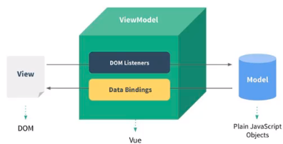
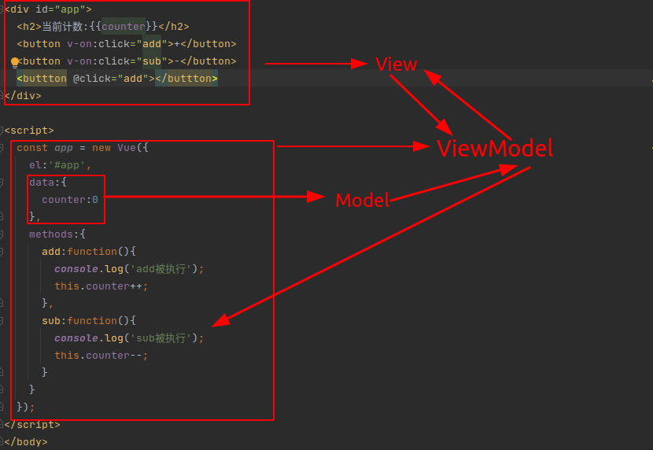

# 邂逅Vue.js 

## 1、认识Vue.js

- Vue (读音 /vjuː/，类似于 **view**) 
- Vue是一个渐进式的框架，什么是渐进式？
  - 渐进式意味着你可以将Vue作为你应用的一部分嵌入其中，带来更丰富的交互体验
    它可以与想要被重构的代码一同存在，然后逐步替换之前的代码。
  - 如果你希望将更多的业务逻辑使用Vue实现，Vue的核心库以及生态系统可以满足需求
    比如Core+Vue-router+Vuex，可以满足各种各样的要求
- Vue有很多特点和Web开发中常见的高级功能
  - 解耦视图和数据
  - 可复用的组件
  - 前端路由技术
  - 状态管理
  - 虚拟DOM

## 2、VueJs的安装方式

安装Vue的方式有很多：

- 使用CDN引入

  ```html
  <!-- 开发环境版本，包含了有帮助的命令行警告 -->
  <script src="https://cdn.jsdelivr.net/npm/vue@2/dist/vue.js"></script>
  <!-- 生产环境版本，优化了尺寸和速度 -->
  <script src="https://cdn.jsdelivr.net/npm/vue@2"></script>
  ```

- 下载和引入

  ```
  开发环境 https://cn.vuejs.org/js/vue.js
  生成环境 https://cn.vuejs.org/js/vue.min.js
  ```

- NPM安装

  - 使用该方式也可以下载和使用webpack和CLI

## 3、VueJs初体验

- 原始的js做法(编程方式：命令式编程)

  - 创建div元素，设置id属性
  - 定义一个变量叫message
  - 将message变量放在前面的div元素中显示

- Vue的做法(声明式编程)

  ```html
  <div id="app">{{message}}</div>
  
  <script src="./js/vue.js"></script>
  <script>
    // let / const
    // let 变量
    // const 常量
    const app = new Vue({
      el:'#app', // 用于挂载要管理的元素
      data:{ //定义数据
        message:'Hello World'
      }
    });
  </script>
  ```

- Vue 列表展示

  ```html
  <div id="app">
      <ul>
          <li v-for="item in movies">{{item}}</li>
      </ul>
  </div>
  
  <script>
    const app = new Vue({
      el : '#app',
      data:{
        message:'Hello',
        movies:[
            '星际穿越',
            '大话西游',
            '少年派',
            '盗梦空间'
        ]
      }
    });
  </script>
  ```

- 案例：计数器

  ```html
  <div id="app">
    <h2>当前计数:{{counter}}</h2>
    <button v-on:click="counter++">+</button>
    <button v-on:click="counter--">-</button>
  </div>
  
  <script>
    const app = new Vue({
      el:'#app',
      data:{
        counter:0
      }
    });
  </script>
  ```

  ```html
  <div id="app">
    <h2>当前计数:{{counter}}</h2>
    <button v-on:click="add">+</button> <!--@click是v-on:click的语法糖-->
    <button v-on:click="sub">-</button>
  </div>
  
  <script>
    const app = new Vue({
      el:'#app',
      data:{
        counter:0
      },
      methods:{ //新的属性：定义方法
        add:function(){
          console.log('add被执行');
          this.counter++;
        },
        sub:function(){
          console.log('sub被执行');
          this.counter--;
        }
      }
    });
  </script>
  ```

  

## 4、VueJs的MVVM

- Vue的MVVM
  

- View层
  - 视图层
  - 前端开发中指DOM层
  - 主要的作用是给用户展示信息
- Model层
  - 数据层
  - 数据可能是我们固定的数据，但更多的是来自服务器的数据，从网络上请求下来的数据
- ViewModel层
  - 视图模型层
  - ViewModel 是 View 和 Model 沟通的桥梁
  - 它实现了Data Binding（数据绑定），将数据的改变实时反应到 View 中
  - 它实现了 DOM Listener（DOM监听），可以监听到并在需要的情况下改变的 Data



