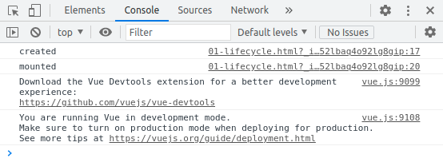

# Day 02


## 1 创建Vue实例传入options

可以在Vue的官网查看相应的文档： https://cn.vuejs.org/v2/api/

目前掌握这些选项

- el:
  - **类型**：`string | Element`
  - **作用**：提供一个在页面上已存在的 DOM 元素作为 Vue 实例的挂载目标（决定之后Vue实例会管理哪一个DOM）
- data:
  - **类型**：`Object | Function`
  - **作用**：Vue实例对应的数据对象
- methods:
  - **类型**：`{ [key: string]: Function }`
  - **作用**：定义属于Vue的一些方法，可以在其他地方调用，也可以在指令中使用


## 2 Vue的生命周期


- 对应生命周期的方法实例：

  ```html
  <div id="app"></div>
  <script>
      const app = new Vue({
          el:'#app',
          data:{
              message:'Hello World'
          },
          created:function(){
              console.log('created'); // 创建实例后向控制台输出created
          },
          mounted:function(){
              console.log('mounted'); // 挂载完数据后向控制台输出mounted
          }
      });
  </script>
  ```

  

- 生命周期函数

