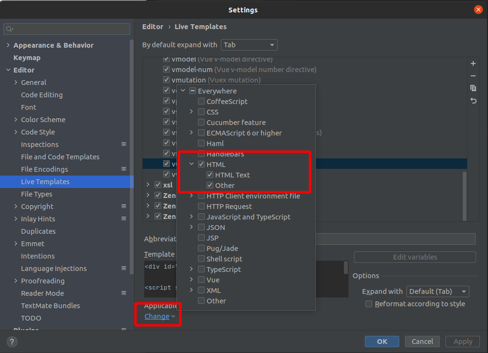

# Day 02


## 1 创建Vue实例传入options

可以在Vue的官网查看相应的文档： https://cn.vuejs.org/v2/api/

目前掌握这些选项

- el:
  - **类型**：`string | Element`
  - **作用**：提供一个在页面上已存在的 DOM 元素作为 Vue 实例的挂载目标（决定之后Vue实例会管理哪一个DOM）
- data:
  - **类型**：`Object | Function`
  - **作用**：Vue实例对应的数据对象
- methods:
  - **类型**：`{ [key: string]: Function }`
  - **作用**：定义属于Vue的一些方法，可以在其他地方调用，也可以在指令中使用


## 2 Vue的生命周期


- 对应生命周期的方法实例：

  ```html
  <div id="app"></div>
  <script>
      const app = new Vue({
          el:'#app',
          data:{
              message:'Hello World'
          },
          created:function(){
              console.log('created'); // 创建实例后向控制台输出created
          },
          mounted:function(){
              console.log('mounted'); // 挂载完数据后向控制台输出mounted
          }
      });
  </script>
  ```

  

- 生命周期函数

  - `beforeCreate`
  - `created`
  - `beforeMounte`
  - `mounted`
  - `beforeUpdate`
  - `updated`
  - `beforeDestory`
  - `destoried`


## 3 WebStorm Template

一般我们创建一个新的文件，就又要重新写一些基本的代码。

这样做会比较麻烦

WebStorm提供了一个自定义模板的功能，我们可以将一些基本的代码定义在里面，然后我们用的时候再用关键字tab出来即可

1. Vue 基本代码

   ```html
   <div id="app">{{message}}</div>
   
   <script src="./js/vue.js"></script>
   
   <script>
     const app = new Vue({
       el:'#app',
       data:{
         message:'你好'
       }
     });
   </script>
   ```

2. 复制上面的代码，然后打开Settings
   
   
   
   

3. 按照上面的步骤做了之后，我们在WebStorm的HTML文件中就可以轻松打出我们要的基本代码

   - 
     

   - 
     


## Vue Mustache

- `{{}}`: Mustache

- 代码

  ```html
  <div id="app">
    <h2>{{message}}, Vue</h2>
    <h2>{{firstName + lastName}}</h2> <!--Mustache不仅可以输出变量，还能输出一些简单的表达式-->
    <h2>{{firstName + ' ' + lastName }}</h2> <!--kobe bryant-->
    <h2>{{counter*2}}</h2> <!--200-->
  
  </div>
  
  <script src="./js/vue.js"></script>
  
  <script>
    const app = new Vue({
      el:'#app',
      data:{
        message:'你好',
        firstName:'kobe',
        lastName:'bryant',
        counter:100
      }
    });
  </script>
  ```


## Vue v-one

- 这个指令的作用就是能够确保它不会被改变原来的值，一旦定义就不会改变

- 代码

  ```html
  <div id="app">
    <h2>{{message}}</h2>
    <h2 v-once>{{message}}</h2>
  </div>
  
  <script src="./js/vue.js"></script>
  
  <script>
    const app = new Vue({
      el:'#app',
      data:{
        message:'你好'
      }
    });
  </script>
  ```

  
  


## Vue v-html

有的时候一些数据有一些标签的信息

```html
<div id="app">
  <span>{{url}}</span> <!--我们这样写，只会单纯展示字符串，而不会将字符串的内容解析到浏览器作为标签的形式展示-->
  <br>
  <span v-html="url"></span> <!--使用v-html就可以做到解析字符串然后转化为标签使用了-->
</div>

<script src="./js/vue.js"></script>

<script>
  const app = new Vue({
    el:'#app',
    data:{
      message:'你好',
      url:'<a href="https://www.baidu.com">baidu.com</a>'
    }
  });
</script>
```


## Vue v-text

跟Mustache功能一样，能够展示变量的字符串

```html
<div id="app">
  <h2>{{message}} vue</h2>
  <h2 v-text="message"> Vue</h2> <!--虽然能够做到展示字符内容，但是相对mustache来说不够灵活-->
</div>

<script src="./js/vue.js"></script>

<script>
  const app = new Vue({
    el:'#app',
    data:{
      message:'你好'
    }
  });
</script>
```


## Vue v-pre

展示原有的数据

```html
div id="app">
  <h2>{{message}}</h2>
  <h2 v-pre>{{message}}</h2> <!--这里不会进行数据绑定还有展示的操作，v-pre 表示原有字符和数据-->
</div>

<script src="./js/vue.js"></script>

<script>
  const app = new Vue({
    el:'#app',
    data:{
      message:'你好'
    }
  });
</script>
```


## Vue v-cloak

```html
<!DOCTYPE html>
<html lang="en">
<head>
  <meta charset="UTF-8">
  <title>Title</title>
  <style>
    [v-cloak]{
      display: none;
    }
  </style>
</head>
<body>
<div id="app" v-cloak> <!--添加此关键字，当vue没有被加载时，v-cloak属性是存在的，但是vue加载出来后，v-clack的标签就不存在了-->
  {{message}} <!--如果网络有延迟的话，vue没有真正加载出来，用户就会看到{{message}}。加载出来后再进行变量替换，给用户的体验会不好-->
</div>

<script src="./js/vue.js"></script>

<script>

  /*
  *   模拟网络延迟一秒
  * */
  setInterval(function(){
    const app = new Vue({
      el:'#app',
      data:{
        message:'你好'
      }
    });
  },1000);
</script>
</body>
</html>
```


## Vue v-bind

- 作用：动态绑定属性

- 缩写：`::`

- 实例代码

  ```html
  <div id="app">
  <!--  错误的做法-->
  <!--  -->
  <!--  正确的做法-->
    
    <br>
    <a v-bind:href="url">{{message}}</a>
  </div>
  
  <script src="./js/vue.js"></script>
  
  <script>
    const app = new Vue({
      el:'#app',
      data:{
          message:'百度一下',
          imgUrl:'https://cn.vuejs.org/images/logo.svg',
          url:'https://www.baidu.com'
      }
    });
  </script>
  ```

- 语法糖

  ```html
  
  ```

- v-bind 动态绑定class

  形式:`<div :class="{key1:value1,key2:value2}">{{message}}</>`
  
  ```html
  <div id="app">
  <!--  <h1 :class="active">{{message}}</h1>-->
    <h2 v-bind:class="{active:isActive,line:isLine}">{{message}}</h2>
  </div>
  
  <script src="./js/vue.js"></script>
  
  <script>
    const app = new Vue({
      el:'#app',
      data:{
          message:'Hello World',
          active:'active',
          line:'line',
          isActive:true,
          isLine:true
      }
    });
  </script>
  
  <!--
  更改变量的bool值，在class中添加或者删除class
  如：isLine如果是false的话，那么h2只有一个class是active
     isLine如果是true的话，那么h2有两个class 一个是 active 一个是 line
  -->
  ```

- 根据上面的特性设计一个程序：点击按钮更改字体颜色

  ```html
  <div id="app">
  <!--  <h1 :class="active">{{message}}</h1>-->
    <h2 v-bind:class="{active:isActive,line:isLine}">{{message}}</h2>
    <button v-on:click="buttonClick">按钮</button>
  </div>
  
  <script src="./js/vue.js"></script>
  
  <script>
    const app = new Vue({
      el:'#app',
      data: {
          message: 'Hello World',
          active: 'active',
          line: 'line',
          isActive: true,
          isLine: true
      },
      methods:{
          buttonClick:function(){
              this.isLine = !this.isLine;
          }
      }
    });
  </script>
  ```

- 可以同时设置有绑定的class和没有绑定的class

  ```html
  <div id="app">
  <!--  <h1 :class="active">{{message}}</h1>-->
    <!--这样做之后没有绑定的class会整合到绑定到class中去-->
    <h2 class="example" v-bind:class="{active:isActive,line:isLine}">{{message}}</h2>
    <button v-on:click="buttonClick">按钮</button>
  </div>
  
  <script src="./js/vue.js"></script>
  
  <script>
    const app = new Vue({
      el:'#app',
      data: {
          message: 'Hello World',
          active: 'active',
          line: 'line',
          isActive: true,
          isLine: true
      },
      methods:{
          buttonClick:function(){
              this.isLine = !this.isLine;
          }
      }
    });
  </script>
  ```

- v-bind 动态绑定class（函数绑定）

  ```html
  <div id="app">
      <!--可以使用调用函数的方式获取到参数-->
    <h2 class="example" v-bind:class="getClassName()">{{message}}</h2>
  </div>
  
  <script src="./js/vue.js"></script>
  
  <script>
    const app = new Vue({
      el:'#app',
      data: {
          message: 'Hello World',
          active: 'active',
          line: 'line',
          isActive: true,
          isLine: true
      },
      methods:{
          getClassName:function(){
              return {active:this.isActive,line:this.isLine}
          }
      }
    });
  </script>
  ```

- v-bind 动态绑定class （数组绑定）

  ```html
  <div id="app">
    <h2 :class="[active,line]">{{message}}</h2>
  </div>
  
  <script src="./js/vue.js"></script>
  
  <script>
    const app = new Vue({
      el:'#app',
      data:{
          message:'Hello World',
          active:'active',
          line:'line'
      }
    });
  </script>
  ```

- v-bind 动态绑定class （使用函数绑定，函数返回数组）

  ```html
  <div id="app">
    <h2 :class="getClassName()">{{message}}</h2>
  </div>
  
  <script src="./js/vue.js"></script>
  
  <script>
    const app = new Vue({
      el:'#app',
      data:{
          message:'Hello World',
          active:'active',
          line:'line'
      },
      methods:{
          getClassName:function(){
              return [this.active, this.line];
          }
      }
    });
  </script>
  ```

  


## Vue v-bind  和 v-for 的结合


