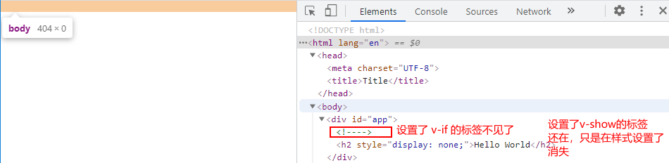

# day 03


## 1 Vue 动态绑定样式

```html
<div id="app">
  <h2 :style="{fontSize:'72px'}">{{message}}</h2>
</div>

<script src="./js/vue.js"></script>

<script>
  const app = new Vue({
    el:'#app',
    data:{
        message:'Hello World'
    }
  });
</script>
```

> 注意 `<h2 :style="{fontSize:'这个地方一定要加单引号'}">{{message}}</h2>`
>
> 如果没加单引号的话，Vue会默认这个是变量


```html
<div id="app">
  <h2 :style="{fontSize:finalSize}">{{message}}</h2>
</div>

<script src="./js/vue.js"></script>

<script>
    const app = new Vue({
        el:'#app',
        data:{
            message:'Hello World',
            finalSize:'100px' // 假设这个变量是从网络请求过来的
        }
    });
</script>
```

> 这样做就可以动态的更改我们元素的样式了


```html
<div id="app">
  <h2 :style="[baseStyle, fontSize]">{{message}}</h2>
</div>

<script src="./js/vue.js"></script>

<script>
  const app = new Vue({
    el:'#app',
    data:{
        message:'Hello World',
        baseStyle:{backgroundColor:'red'},
        fontSize:{fontSize: '100px'}
    }
  });
</script>
```

> 使用数组动态绑定可以动态绑定多组样式


## 2 Vue 计算属性的使用

在模板中可以直接通过插值语法显示一些data中的数据

我们可能需要对数据进行一些转化后再显示，或者需要将多个数据结合起来进行显示

- 比如我们有 `firstName` 和 `lastName`两个变量，我们需要显示完整的名称
- 但是如果有多个地方都需要显示完整的名称，我们就需要写多个`{{firstName}}` 和 `lastName`

为了解决这个麻烦的问题，我们可以使用计算属性

```html
<div id="app">
  <h2>{{firstName + ' ' + lastName}}</h2>
  <h2>{{firstName}} {{lastName}}</h2>
  <h2>{{getFullName()}}</h2> <!--虽然比上面两个简单了很多，但是这里表示的不是一个变量而是一个函数-->
  <h2>{{fullName}}</h2>
</div>

<script src="./js/vue.js"></script>

<script>
  const app = new Vue({
    el:'#app',
    data:{
      message:'Hello World',
      firstName:'Kobe',
      lastName:'Bryant'
    },
    methods:{
      getFullName(){
          return this.firstName + ' ' + this.lastName;
      }
    },
    computed:{
      fullName:function(){
          return this.firstName + ' ' + this.lastName;
      }
    }
  });
</script>
```

> 使用计算属性我们要注意要把它当==属性==使用，而不是函数
>
> - 定义计算属性的地方是 computed关键字下面的json
> - 使用的时候要注意区分 methods 和 computed 的用法，methods是定义函数， computed 是定义属性，属性是可以由多个data里面的属性进行组合或者计算的


```html
<div id="app">
  <h2>总价格 : {{totalPrice}}</h2> <!--我们可以使用计算属性来做一些复杂的操作-->
</div>

<script src="./js/vue.js"></script>

<script>
  const app = new Vue({
    el:'#app',
    data:{
        message:'Hello World',
        books:[
            {id:110, name:'Unix编程艺术', price: 119},
            {id:111, name:'代码大全', price: 105},
            {id:112, name:'深入理解计算机组成原理', price: 98},
            {id:113, name:'现代操作系统', price: 87}
        ]
    },
    computed:{
        totalPrice:function(){
          let result = 0 ;
          for(let book of this.books){
              result += book.price;
          }
          return result; //算出所有书价格的总和然后返回回去
        }
    }
  });
</script>
```

> 虽然这个操作使用methods 是可以做到的
>
> 但是这里更多的是强调是属性，显示一个数值或者数据的做法在vue中更多的是用属性来表示的


```html
<div id="app">
  {{fullName}}
</div>

<script src="./js/vue.js"></script>

<script>
  const app = new Vue({
    el:'#app',
    data:{
        message:'Hello World',
        firstName:'Kobe',
        lastName:'Bryant'
    },
    computed:{
        // fullName:function(){  // 简单方法
        //     return this.firstName + ' ' + this.lastName;
        // }
        fullName:{ // 当然这样写太麻烦了，所以就有了上面的简单写法
          // set:function(){ 计算属性一般是没有set方法的，只读属性
          //
          // },
          set:function(newValue){
            const names =  newValue.splice(' ');
            this.firstName = names[0];
            this.lastName = names[1];
          },
          get:function(){
            return this.firstName + " " +this.lastName;
          }
        }
    }
  });
</script>
```

> 计算属性完整的写法是有get ， set方法的
>
> 但是在计算属性中是没有set方法的，因为计算属性起的作用就是只读（当然你也可以使用set方法）
>
> 完整的写法写下来还是有点复杂的，所以就有了上面的简单的写法

---

```html
<div id="app">
<!--  1，直接拼接 : 太麻烦 直接排除  -->
  <h2>{{firstName}} {{lastName}}</h2>
<!--  2，通过定义methods-->
  <h2>{{getFullName()}}</h2>
  <h2>{{getFullName()}}</h2>
  <h2>{{getFullName()}}</h2>
  <h2>{{getFullName()}}</h2>
  <h2>{{getFullName()}}</h2>
<!--  3，通过computed-->
  <h2>{{fullName}}</h2>
  <h2>{{fullName}}</h2>
  <h2>{{fullName}}</h2>
  <h2>{{fullName}}</h2>
  <h2>{{fullName}}</h2>
</div>

<script src="./js/vue.js"></script>

<script>
  const app = new Vue({
    el:'#app',
    data:{
      message:'Hello World',
      firstName:'Kobe',
      lastName:'Bryant'
    },
    methods:{
      getFullName:function(){
        console.log('getFullName'); //看调用了几次
        return this.firstName + ' ' + this.lastName;
      }
    },
    computed:{
      fullName:function(){
        console.log('fullName'); // 看调用了几次
        return this.firstName + ' ' + this.lastName;
      }
    }
  });
</script>
```


## 2 ES6 let/var

var的设计是JavaScript语言设计上的错误，但是这个错误多班不能修复和移除，因为需要向后兼容

所以JavaScript的作者决定要修复这个问题，所以添加了一个关键字`let`

- 块级作用域
  - JS中使用var来声明一个变量时，变量的作用域是和函数的定义有关
  - let 是有块级作用域的

```html
<script>
  {
    var name = 'Hello';
    console.log("块里面 "+name);
  }
  console.log("块外面 "+name);
</script>
```


> 这样表明了 var 是没有块级作用域的

---

```html
<script>
  var func;
  if(true){
    var name = 'hello';
    func = function(){
      console.log(name);
    }
  }
  name = 'it change'

  func(); //这里本应该是hello才对的，但是这里是it change
</script>
```

> 这个例子表现了 var 的巨大缺陷，所以现在需要一个关键字，能够做到块级作用域的特点

---

```html
<!DOCTYPE html>
<html lang="en">
<head>
  <meta charset="UTF-8">
  <title>Title</title>
</head>
<body>
<button>0</button>
<button>1</button>
<button>2</button>
<button>3</button>
<button>4</button>
<button>5</button>
<button>6</button>
<button>7</button>
<button>8</button>
<button>9</button>

<script>
  var btns = document.getElementsByTagName('button');
  for(var i=0;i<btns.length;i++){
    btns[i].addEventListener('click',function(){
      console.log('第'+i+'个按钮被点击');
    });
  }
</script>
</body>
</html>
```


> 无论点哪个按钮都是第十个按钮被点击，这也体现了 var 没有块级作用域的缺点

---

```html
<script>
  //3。没有块级作用域引起的问题：for的块级
  //像这种问题我们可以使用闭包来解决
  var btns = document.getElementsByTagName('button');
  for(var i=0;i<btns.length;i++){
    (function(i){
        btns[i].addEventListener('click',function(){
          console.log('第'+i+'个按钮被点击');
        });
    })(i);
  }
</script>
</body>
</html>
```


> 这里采用闭包就可以解决我们上面的问题，因为 var 只认函数作用域。

---

ES5之前因为 `if` 和 `for` 都没有块级作用域的概念，所以在很多时候，我们都必须借助于function的作用域来解决应用外部变量的问题

ES6 引用了 `let` ，有了块级作用域的概念

```html
<script>
  // 这里 用 let 代替了 var
  const btns = document.getElementsByTagName('button');
  for(let i =0;i<btns.length;i++){
    btns[i].addEventListener('click',function(){
      console.log('第'+i+'个按钮被点击');
    });
  }
</script>
```


> 从上图我们可以看到，我们使用 let 代替 var了之后，我们看到了 let 是有块级作用域的，这样我们就可以省掉了闭包的操作

---


## 3 ES6 const

const

- 作用是定义常量
- 使用const修室的标识符定义的常量，不可以再次赋值

当我们修饰的标识符不再次赋值的时候，我们使用const关键字修饰，这样可以保证我们数据的完整性和安全性

**建议在开发中，优先使用const，如果我们想改变某一个标识符的话，就使用let**

```javascript
const a = 20;
a = 30; //这样做会报错，因为const修饰的标识符不能再次被赋值

const a; //这样做会报错，因为const修饰的标识符一定要被赋值
```

---

```js
const obj = {
    name:'bin',
    age:23,
    height:1.86
}

obj.name = 'wen' //这样做是可以的
obj.age = 21
obj.height = 1.87
```

> 常量的含义是指指向的对象不能修改，但是可以改变对象内部的属性
>
> 这样看来，确切地来说，使用const修饰表明指向的内存地址是不变的。


## 4 ES6 对象字面量的增强写法

什么是字面量写法

```javascript
const obj = new Object(); //传统写法
const obj1 = {} //字面量写法
```

1. 属性的增强写法

```javascript
//传统写法
const name = 'why';
const age = 18;
const height = 1.88;

const obj = {
    name : name,
    age : age,
    height:height
}

// 增强写法
const obj1{
    name,
   	age,
    height
}
```

> 省略了赋值的操作，将变量名变成属性名，然后属性值是变量具体的值

---

2. 函数的增强写法

```javascript
// 传统写法
const obj = {
    run:function(){
        
    },
    eat:function(){
        
    }
}

// 增强写法
const obj1 = {
    run(){
        
    },
    eat(){
        
    }
}
```

> 更加贴近Java的风格，写法也更加简单

---


## 5 Vue v-on的使用

事件监听

前端开发中，用户需要跟接口进行交互，比如用户会点击，拖拽和敲击键盘等等

在 `Vue` 中使用 `v-on`指令来监听事件

**v-on**

- **作用**: 监听事件
- **缩写**: `@`
- **预期**: `Function | Inline Statement | Object`
- **参数**: `event`

---

1. v-on 能够接收简单的表达式

   ```html
   <div id="app">
     <h2>{{counter}}</h2>
     <button v-on:click="counter++">+</button>
     <button v-on:click="counter--">-</button>
   </div>
   
   <script src="./js/vue.js"></script>
   
   <script>
     const app = new Vue({
       el:'#app',
       data:{
         message:'Hello World',
         counter:0
       }
     });
   </script>
   ```

---

2. v-on 能够接受函数

   ```html
   <div id="app">
     <h2>{{counter}}</h2>
     <button v-on:click="increament">+</button>
     <button v-on:click="decreament">-</button>
   </div>
   
   <script src="./js/vue.js"></script>
   
   <script>
     const app = new Vue({
       el:'#app',
       data:{
         message:'Hello World',
         counter:0
       },
       methods:{
         increament(){
           this.counter++;
         },
         decreament(){
           this.counter--;
         }
       }
     });
   </script>
   ```

---

3. v-on 语法糖 `@`

   ```html
   <div id="app">
     <h2>{{counter}}</h2>
     <button @click="increament">+</button>
     <button @click="decreament">-</button>
   </div>
   
   <script src="./js/vue.js"></script>
   
   <script>
     const app = new Vue({
       el:'#app',
       data:{
         message:'Hello World',
         counter:0
       },
       methods:{
         increament(){
           this.counter++;
         },
         decreament(){
           this.counter--;
         }
       }
     });
   </script>
   ```

---


## 6 Vue v-on 传递参数

通过methods中定义方法，以供`@click`调用的时候，需要注意参数问题

- 情况一：如果该方法不需要额外的参数，那么方法后`()`可以不添加

  > 注意：如果方法本身中有一个参数，那么会默认将原生事件event参数传递进去

- 情况二：如果需要同时传入某个参数，同时需要event时，可以通过$event传入事件

1. 情况一

   ```html
   <div id="app">
     <button @click="btnClick()">按钮1</button>
     <button @click="btnClick">按钮2</button>
   </div>
   
   <script src="./js/vue.js"></script>
   
   <script>
     const app = new Vue({
       el:'#app',
       data:{
           message:'Hello World'
       },
       methods:{
         btnClick(){
           console.log("Click the Button!");
         }
       }
     });
   </script>
   ```

   > 当没有参数传入的时候，我们可以不用写括号

   ---

   ```html
   <div id="app">
     <button @click="btnClick()">按钮1</button>
     <button @click="btnClick">按钮2</button>
   
     <button @click="btn1Click">按钮3</button>
   </div>
   
   <script src="./js/vue.js"></script>
   
   <script>
     const app = new Vue({
       el:'#app',
       data:{
           message:'Hello World'
       },
       methods:{
         btnClick(){
           console.log("Click the Button!");
         },
         btn1Click(abc){
           console.log("event对象",abc);
         }
       }
     });
   </script>
   ```

   > 当我们事件方法有参数的时候我们没有选择传入参数的时候，系统的event对象（Window对象创建的）就会被传入进去，而且替代事件方法第一个参数的位置

   ---

2. 情况二

   ```html
   <div id="app">
     <button @click="btn2Click">按钮4</button> <!--第一个参数是Window生成的event对象，第二个参数在函数会是undefined-->
     <button @click="btn2Click('123',event)">按钮5</button> <!--这里会报错,因为data里面没有event的这个变量-->
     <button @click="btn2Click('123',$event)">按钮6</button> <!--$event 表示Window生成的event对象-->
   </div>
   
   <script src="./js/vue.js"></script>
   
   <script>
     const app = new Vue({
       el:'#app',
       data:{
           message:'Hello World'
       },
       methods:{
         btnClick(){
           console.log("Click the Button!");
         },
         btn1Click(abc){
           console.log("event对象",abc);
         },
         btn2Click(abc,event){
           console.log(abc, event);
         }
       }
     });
   </script>
   ```

   


## 7 Vue v-on 修饰符

Vue 提供了一些修饰符帮助开发者方便处理一些事件

- `.stop `: 调用的是 `event.stopPropagation()`
- `.prevent`: 调用 `event.preventDefault()`
- `.{keyCode|keyAlias}`: 只当事件是从特定键出发时才会触发回调
- `.native`: 监听组件根元素的原生事件
- `.once`: 只触发一次回调

1. 阻止事件冒泡

   ```html
   <div id="app">
     <div @click="divClick">
       <button @click.stop="buttonClick">按钮</button> <!--.stop 的作用是阻止事件冒泡-->
     </div>
   </div>
   
   <script src="./js/vue.js"></script>
   
   <script>
     const app = new Vue({
       el:'#app',
       data:{
           message:'Hello World'
       },
       methods:{
         buttonClick(){
           console.log('click button');
         },
         divClick(){
           console.log('click div');
         }
       }
     });
   </script>
   ```

   > 点击 button 的时候 就不会 触发 divClick

   ----

2. 阻止默认行为

   ```html
   <div id="app">
     <form action="http://baidu.com">
       <input type="submit" @click.prevent="submitButton"> <!--点击后不会进行跳转-->
     </form>
   </div>
   
   <script src="./js/vue.js"></script>
   
   <script>
     const app = new Vue({
       el:'#app',
       data:{
           message:'Hello World'
       },
       methods:{
         submitButton(){
           console.log("submitButtonClick");
         }
       }
     });
   </script>
   ```

   > 点击 submit 的时候不会跳转到相应的页面，阻止了input标签的默认行为

   ---

3. 监听键盘按键的修饰符

   ```html
   <div id="app">
     <input type="text" @keyup.enter="keyupfunction">
   </div>
   
   <script src="./js/vue.js"></script>
   
   <script>
     const app = new Vue({
       el:'#app',
       data:{
           message:'Hello World'
       },
       methods:{
         keyupfunction(){
           console.log("keyup");
         }
       }
     });
   </script>
   ```

   > 敲击键盘的时候会触发keyupfunction方法，但是这里的修饰符对此做了限制，只有按下 Enter 键的时候才会触发

   ---

4. 只触发一次的修饰符

   ```html
   <div id="app">
     <button @click.once="onceFunction">点击</button>
   </div>
   
   <script src="./js/vue.js"></script>
   
   <script>
     const app = new Vue({
       el:'#app',
       data:{
           message:'Hello World'
       },
       methods:{
         onceFunction(){
           console.log("once");
         }
       }
     });
   </script>
   ```

   > 只触发一次的onceFunction


## 8 Vue v-if、v-else-if、v-else

1. `v-if` 和 `v-else`的使用

   ```html
   <div id="app">
     <h2 v-if="isTrue">isTrue为true的时候显示</h2>
     <h2 v-else>isTrue为false的时候显示</h2>
   </div>
   
   <script src="./js/vue.js"></script>
   
   <script>
     const app = new Vue({
       el:'#app',
       data:{
         message:'Hello World',
         isTrue:true
       }
     });
   </script>
   ```

2. `v-else-if`的使用

   ```html
   <div id="app">
     <h2 v-if="score>=90">优秀</h2>
     <h2 v-else-if="score>=80">良好</h2>
     <h2 v-else-if="score>=60">及格</h2>
     <h2 v-else>不及格</h2>
   </div>
   
   <script src="./js/vue.js"></script>
   
   <script>
     const app = new Vue({
       el:'#app',
       data:{
         message:'Hello World',
         score:99
       }
     });
   </script>
   ```


## 9 Vue 登录切换案例

1. 案例代码

   ```html
   <!DOCTYPE html>
   <html lang="en">
   <head>
     <meta charset="UTF-8">
     <title>Title</title>
   </head>
   <body>
   <div id="app">
     <span v-if="isUser">
       <label for="username">用户账号</label>
       <input type="text" id="username" placeholder="输入用户账号">
     </span>
     <span v-else>
       <label for="mail">用户邮箱</label>
       <input type="text" id="mail" placeholder="输入用户邮箱">
     </span>
     <button @click="isUser = !isUser">切换类型</button>
   </div>
   
   <script src="./js/vue.js"></script>
   
   <script>
     const app = new Vue({
       el:'#app',
       data:{
         isUser:true
       }
     });
   </script>
   </body>
   </html>
   ```

2. 代码问题

   

   

3. 分析原因：

   这是因为Vue在处理两个相同的标签的时候，为了更高效率使用，其实切换的过程中，看似两个不同的标签其实是同一个标签来的，这是Vue对于标签代码的复用

4. 解决:

   添加 `key`字段让Vue知道这两个是不一样的标签，取消Vue对其进行复用

   ```html
   <!DOCTYPE html>
   <html lang="en">
   <head>
     <meta charset="UTF-8">
     <title>Title</title>
   </head>
   <body>
   <div id="app">
     <span v-if="isUser">
       <label for="username">用户账号</label>
       <input type="text" id="username" placeholder="输入用户账号" key="username">
     </span>
     <span v-else>
       <label for="mail">用户邮箱</label>
       <input type="text" id="mail" placeholder="输入用户邮箱" key="email">
     </span>
     <button @click="isUser = !isUser">切换类型</button>
   </div>
   
   <script src="./js/vue.js"></script>
   
   <script>
     const app = new Vue({
       el:'#app',
       data:{
         isUser:true
       }
     });
   </script>
   </body>
   </html>
   ```


 

## 10 Vue v-show 

`v-show` 的用法和 `v-if` 非常相似，也用于决定一个元素是否渲染

```html
<div id="app">
  <h2 v-if="isShow">{{message}}</h2>
    <!--这两个的效果是一样的-->
  <h2 v-show="isShow">{{message}}</h2>
</div>

<script src="./js/vue.js"></script>

<script>
  const app = new Vue({
    el:'#app',
    data:{
      message:'Hello World',
      isShow:true
    }
  });
</script>
```

我们将 isShow 设置为 false 了之后看一下效果




这就是 `v-show` 和 `v-if` 的区别

在开发中，在显示和隐藏之间需要切换地频繁的时候，我们需要使用 `v-show`

当只有一次切换的话，我们可以使用`v-if`


## 11 Vue v-for

```html
<div id="app">
 <!--遍历数组元素  -->
  <ul>
    <li v-for="player in players">{{player}}</li>
  </ul>
<!-- 遍历数组元素（显示下标） -->
  <ul>
    <li v-for="(player, index) in players">{{index}}-{{player}}</li>
  </ul>

<!--  遍历对象-->
  <ul>
    <li v-for="item in info">{{item}}</li>
  </ul>
<!--  遍历对象（显示属性名）-->
  <ul>
    <li v-for="(item,label) in info">{{label}}:{{item}}</li>
  </ul>
<!--  遍历对象（显示属性名和下标）-->
  <ul>
    <li v-for="(item, label, index) in info">{{index}}-{{label}}:{{item}}</li>
  </ul>
</div>

<script src="./js/vue.js"></script>

<script>
  const app = new Vue({
    el:'#app',
    data:{
      message:'Hello World',
      players:['bin','kobe','james','curry'],
      info:{
        name:'Bin',
        age:21,
        height:1.86
      }
    }
  });
</script>
```


## 12 组件的Key属性

Vue官方推荐我们使用`v-for`时，给对应的元素或者组件添上一个`key属性`

- 为什么我们要添加这个属性

  是因为这个属性和Vue虚拟DOM的DIff算法有关系，使用这个属性，我们才能发挥Diff算法的作用

  当某一层有很多相同的节点（列表节点），我们希望插入一个新的节点，如果没有使用Diff算法的话，我们的算法将回跟数组插入节点一样，先移动一堆节点，然后腾出一个空格出来给新的数据插入。Diff算法则是直接在要插入的地方插入，无论移动一堆节点

  所以我们需要使用key来给每个节点做一个唯一标识。Diff算法可以正确识别节点，并且找到正确的位置插入新的节点。所以 **Key的作用主要是为了高效更新虚拟DOM**


