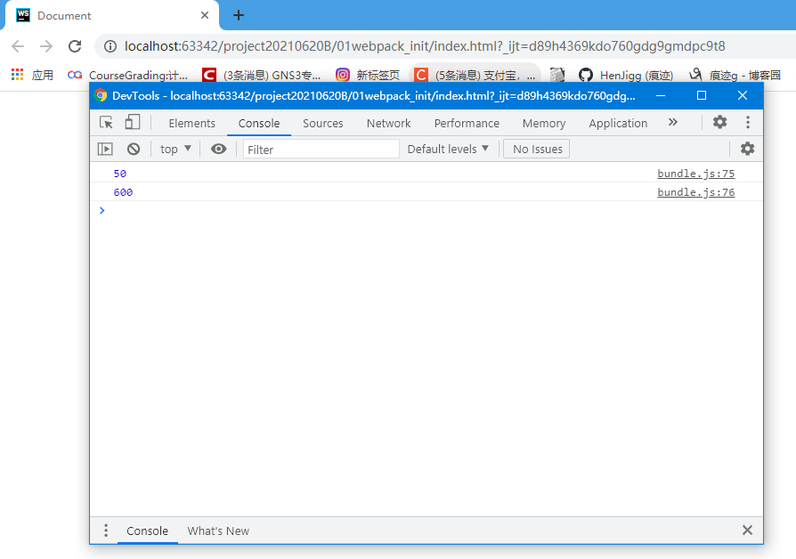
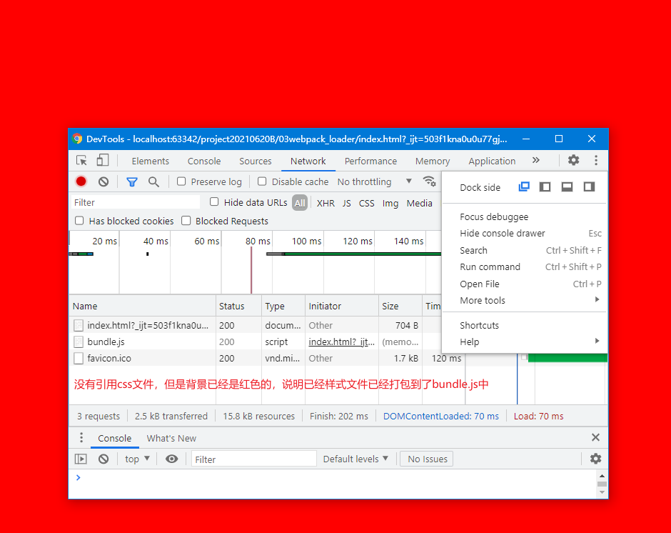
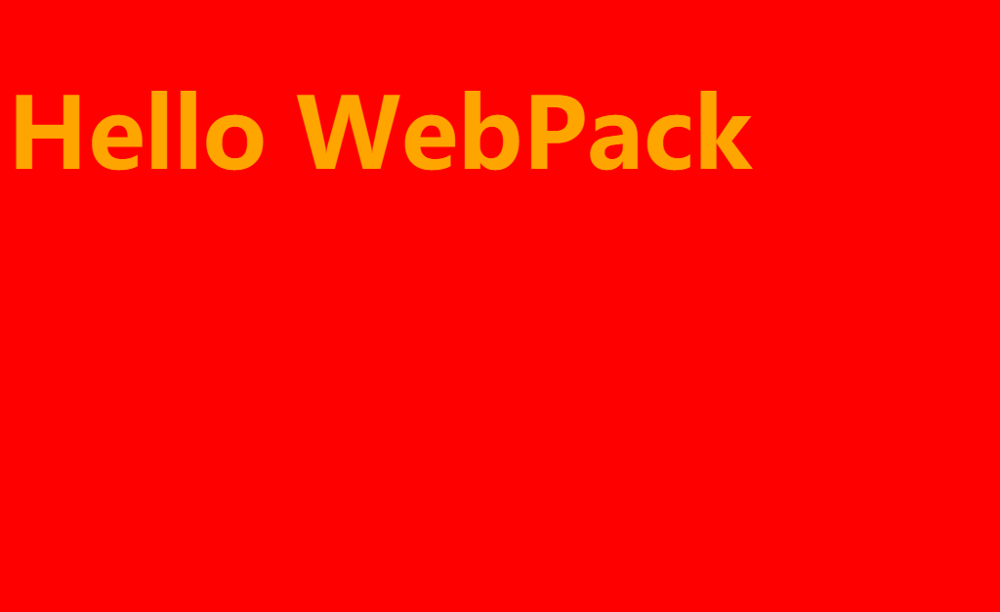
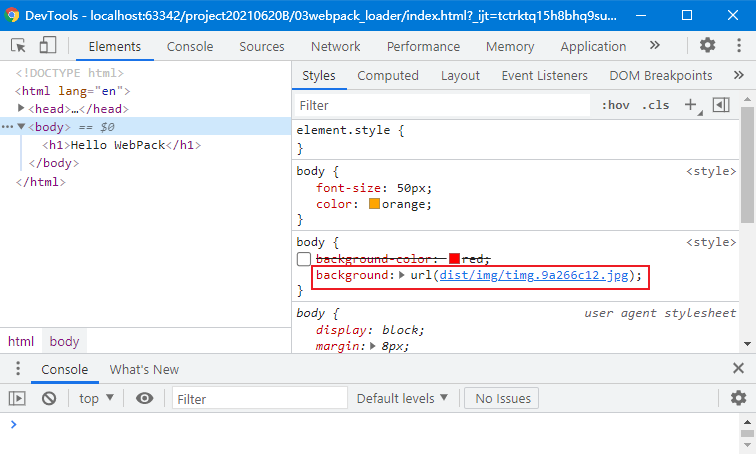
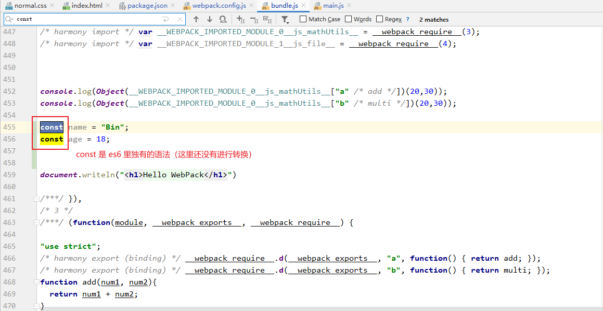
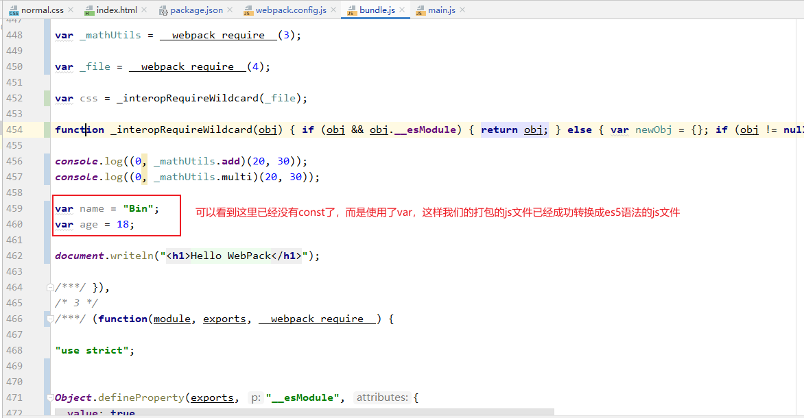
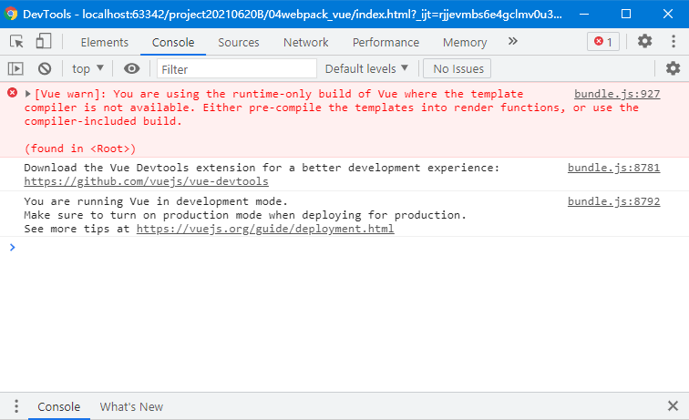
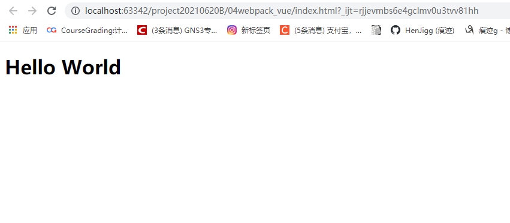
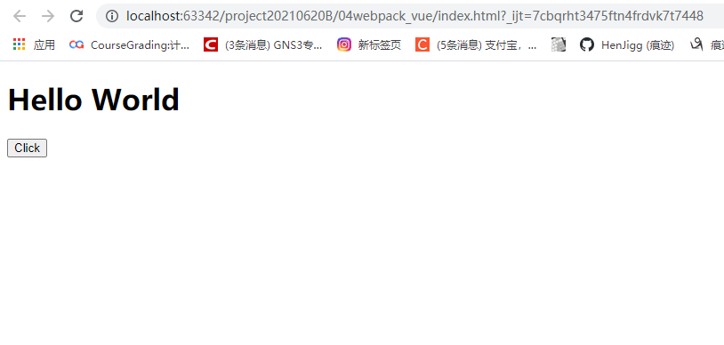

# day 05


## 1 Vue slot

slot的目的就是为了让我们封装的组件更加具有拓展性

让使用者可以决定组件内部的一些内容展示什么

1. 实例

   ```html
   <div id="app">
     <cpn><button>按钮</button></cpn> <!--将我们要要插入的元素放在组件元素里面-->
   </div>
   
   <template id="cpn">
     <div>
       <h2>I'm a component</h2>
       <p>component main body</p>
       <slot></slot> <!--插入的元素就会被放在这里-->
     </div>
   </template>
   
   <script src="./js/vue.js"></script>
   
   <script>
     const app = new Vue({
       el:'#app',
       data:{
         message:'Hello World'
       },
       components:{
         cpn:{
           template:'#cpn'
         }
       }
     });
   </script>
   ```

   ---

2. 设置slot默认值

   ```html
   <div id="app">
     <cpn><button>按钮</button></cpn>
     <cpn></cpn> <!--没有放任何插入元素-->
   </div>
   
   <template id="cpn">
     <div>
       <h2>I'm a component</h2>
       <p>component main body</p>
       <slot><span>这个是默认值</span></slot> <!--如果父组件没有放置任何插入元素的话，那么这里就会显示默认值-->
     </div>
   </template>
   
   <script src="./js/vue.js"></script>
   
   <script>
     const app = new Vue({
       el:'#app',
       data:{
         message:'Hello World'
       },
       components:{
         cpn:{
           template:'#cpn'
         }
       }
     });
   </script>
   ```

   ---

3. 可以放置多个插入元素在slot中

   ```html
   <div id="app">
     <!--可以放置多个插入元素-->
     <cpn>
       <h1>Hello Slot</h1>
       <p>HelloHelloHelloHelloHelloHelloHelloHelloHelloHelloHelloHelloHelloHelloHello</p>
     </cpn>
   </div>
   
   <template id="cpn">
     <div>
       <h2>I'm a component</h2>
       <p>component main body</p>
       <slot><span>这个是默认值</span></slot>
     </div>
   </template>
   
   <script src="./js/vue.js"></script>
   
   <script>
     const app = new Vue({
       el:'#app',
       data:{
         message:'Hello World'
       },
       components:{
         cpn:{
           template:'#cpn'
         }
       }
     });
   </script>
   ```

   ---

4. 具名插槽

   ```html
   <div id="app">
     <cpn>
       <button slot="left">按钮</button>
       <span slot="center">标题</span>
       <spasn slot="right" style="font-weight: bold">字体</spasn>
     </cpn>
   </div>
   
   <template id="cpn">
     <div>
       <slot name="left"><span>左边的</span></slot>
       <slot name="center"><span>中间的</span></slot>
       <slot name="right"><span>右边的</span></slot>
     </div>
   </template>
   
   <script src="./js/vue.js"></script>
   
   <script>
     const app = new Vue({
       el:'#app',
       data:{
         message:'Hello World'
       },
       components:{
         cpn:{
           template:'#cpn'
         }
       }
     });
   </script>
   ```

   ---

5. 作用域插槽

   - 作用域插槽是父组件替换插槽的标签，但是内容是由子组件来提供的

   ```html
   <div id="app">
     <cpn>
       <template v-slot:default="slotProp">
         <h1>{{slotProp.user}}</h1>
       </template>
     </cpn>
   </div>
   
   <template id="cpn">
     <span>
       <slot :user="username">{{username}}</slot>
     </span>
   </template>
   
   <script src="./js/vue.js"></script>
   
   <script>
     const app = new Vue({
       el:'#app',
       data:{
         message:'Hello World'
       },
       components:{
         cpn:{
           template:'#cpn',
           data(){
             return {
               username:'Bin'
             }
           }
         }
       }
     });
   </script>
   ```

   ---

6. 新的具名插槽的写法

   ```html
   <div id="app">
     <cpn>
       <template v-slot:left>
         左边的
       </template>
       <template v-slot:center>
         中间的
       </template>
       <template v-slot:right>
         右边的
       </template>
     </cpn>
   </div>
   
   <template id="cpn">
   <div>
     <slot name="left"></slot>
     <slot name="center"></slot>
     <slot name="right"></slot>
   </div>
   </template>
   
   <script src="./js/vue.js"></script>
   
   <script>
     const app = new Vue({
       el:'#app',
       data:{
         message:'Hello World'
       },
       components:{
         cpn:{
           template:'#cpn'
         }
       }
     });
   </script>
   ```

   ---


## 2 ES6 模块化开发

1. export

   ```javascript
   let name = "john";
   
   export name; //导出
   ```

   ---

   ```javascript
   let name = "john";
   let age = 18;
   
   export {name,age} // 导出对象
   ```

   ---

   ```javascript
   export let name = "john"; //导出（很少使用）
   ```

   ---

   ```javascript
   let name = "john";
   
   export default name; // 默认导出name(对方import默认导入这个)
   ```

   ---

2. import

   ```javascript
   import name from './xxx.js'; // 从xxx.js导入name
   ```

   ---

   ```javascript
   import {name,age} from './xxx.js'; // 结构化解析
   ```

   ---

   ```javascript
   import * as newObject from './xxx.js' //从xxx.js导入全部内容 
   ```


## 3 WebPack使用

1. WebPack的安装

   ```shell
   npm install webpack@3.6.0 -g # 进行全局安装 webpack 3.6.0
   # 之所以使用wbepack@3.6.0， 是因为它能够支持vue-cli2的使用
   ```

   ---

   创建一个文件夹: e.p. use_webpack

   ---

   在use_webpack文件夹里面再创建两个文件夹

   - src
   - dist

   ----

   然后在src文件夹中编写我们的js源码，这里实例用两个js

   - mathUtils.js
   - main.js

   ```javascript
   // mathUtils.js
   
   function add(num1, num2){
       return num1+num2;
   }
   
   function multi(num1, num2){
       return num1*num2;
   }
   
   export {add, multi};
   ```

   ```javascript
   // main.js
   
   import {add, multi} from './mathUtils.js';
   
   console.log(add(20, 30));
   console.log(multi(20,30));
   ```

   ---

   测试：在use_webpack创建一个index.html文件，在里面添加代码

   ```html
   ...
   <script src="./dist/bundle.js"></script>	
   ...
   ```

   然后保存，在对应的目录下启动终端, 编写命令

   ```shell
   webpack ./src/main.js ./dist/bundle.js # 将其打包，然后生成bundle.js
   ```

   ---

   通过浏览器验证是否打包成功

   
   ---


---

2. webpack.config.js配置

   每次打包的时候，我们都要输入`webpack ./src/main.js ./dist/bundle.js`太麻烦了。我们需要有一个东西，来帮我们可以用简短的命令就可以做到上面命令所能做到的东西。所以我们需要有一个配置文件，那就是webpack.config.js。

   ---

   ```javascript
   // 使用common.js进行模块化的导入导出
   
   const path = require('path'); //调用node.js中的path模块
   
   module.exports = {
     entry:'./src/main.js',
     output:{
       // __dirname:是此文件的目录地址
       path:path.resolve(__dirname,'dist'), // path模块有一个函数是resolve，可以将根据os对两个地址进行拼接
       filename:'bundle.js'
     }
   };
   ```

   ---

3. npm init 
   为了方便开发，我们还能使用npm局部安装我们开发需要的版块，然后使用在项目中使用本地目录中下载的版块（而不是安装在全局的目录中）

   首先，我们需要用一行`npm init`的命令，让node帮我们构造一个项目，项目里有对应的配置文件。

   配置文件有: `package.json`

   ---

   ```javascript
   {
     "name": "webpack_config", // 项目名
     "version": "1.0.0", // 项目版本
     "description": "", //项目描述
     "main": "index.js", // 主要的js
     "scripts": { // 预设的脚本
       "build": "webpack"  
     },
     "author": "", // 项目作者
     "license": "ISC" // 项目使用的开源协议
   }
   
   ```

   ---

   假设我们现在有一个这样的需求，就是我们在开发的时候我们需要依赖一个版块，但是我们开发完之后我们就不需要这个版块了，那么有什么命令是可以满足这个需求的？

   ```shell
   npm install webpack@3.6.0 --save-dev # --save-dev 表明我们用开发依赖
   ```

   > 这样我们发布项目的时候，我们的项目是不依赖我们安装的这个组件的

   ---

   我么执行完上面的命令之后，再来看一下 `package.json`

   ```javascript
   {
     "name": "webpack_config",
     "version": "1.0.0",
     "description": "",
     "main": "index.js",
     "scripts": {
       "build": "webpack"
     },
     "author": "",
     "license": "ISC",
     "devDependencies": { // 这里已经添加了我们的已开发依赖
       "webpack": "^3.6.0"
     }
   }
   ```

   > 假如我们把目录下 nod_modules (我们局部安装模块的时候就会自动生成该目录) 删除的话，我们只需要使用`npm install`就可以根据`package.json`上所表明的依赖帮我们下载对应的模块了

   ----

   在 `package.json`中有一个属性是`scripts`。在这个属性中，我们可以自定义脚本。定义好脚本之后，我们在目录下的终端输入 `npm run 脚本对应的属性名` 就可以执行脚本了。**注意**：脚本定义的命令是针对根据局部模块库里的模块，如果我们在项目中的终端使用 脚本对应的命令的话，我们运行的是全局模块库中的模块

   ```shell
   ## 假设build脚本定义的脚本为 webpack
   
   npm run build # 这里执行的是局部模块库中的webpack
   webpack # 这里执行的是全局模块库中的webpack
   ```

   ---

4. loader 的使用

   目前我们都是使用WebPack打包 `js`后缀的文件，但是在开发中我们不单止是用到 js 后缀的文件，还有css，sass文件和其他文件等。那么针对这个情况，我们要又该怎么做呢？

   ---

   这里具体举个例子
   创建一个 `css`文件, 叫`normal.css`

   ```css
   body{
       background-color:red;
   }
   ```

   然后在 `main.js`文件中添加如下代码

   ```javascript
   ...
   import css from './css/normal.css';
   ...
   ```

   ---

   到这里我们还不能打包我们的程序，因为css文件js文件是识别不了的，为了解决打包css文件的问题，webpack提供了`css-loader`和`style-loader`来解决打包`.css`文件的问题

   ```shell
   npm install css-loader@3.3.0 --save-dev # 使用命令安装css-loader模块，并添加到开发者依赖
   
   npm install style-loader@1.0.0 --save-dev # 使用命令安装style-loader模块，并添加到开发者依赖
   ```

   > 注意，如果webpack的版本比较高的话，不需要下载之前的版本
   > 但是如果webpack版本比较低（像本例用的是webpack@3.6.0）。那就需要下载比较低的版本

   ---

   然后我们要在 `webpack.config.js`文件中添加

   ```javascript
   module.exports = {
     ...,
     module: {
       rules: [
         {
           test: /\.css$/i,
           use: ["style-loader", "css-loader"],
         }
       ]
     }
   };
   ```

   > 注意，一定是 style-loader 在前 css-loader 在后（因为先执行css-loader，然后再执行 style-loader【从右到左执行】）

   ---

   然后运行 `npm run build`执行脚本打包程序。最终的效果为

   


---

5. less-loader 的使用

   我们开发的时候，可能我们不想使用css，那我们可以使用sass，less。那么webpack也有对应的loader来对相应的文件进行打包操作。我们来举一个less-loader的例子

   ---

   > 编写 less的代码

   ```less
   @fontSize:50px;
   @fontColor:orange;
   
   body{
     font-size: @fontSize;
     color: @fontColor;
   }
   ```

   ---

   > 然后再 main.js 中，我们导入less

   ```javascript
   ...
   import less from './css/test.less';
   ...
   ```

   ---

   > 局部安装 less-loader 和 less

   ```shell
   npm install less-loader@4.1.0 less@4.1.1 --save-dev
   # 这里使用的是先前的版本（因为webpack的版本是3.6.0。版本过高用不了）
   ```

   ---

   > 在 webpack.config.js 文件中添加规则

   ```javascript
   module.exports = {
     ...,
     module: {
       rules: [
         ...,
         {
           test: /\.less$/i,
           loader: [
             // compiles Less to CSS
             'style-loader',
             'css-loader',
             'less-loader'
           ]
         },
         ...
       ]
     },
     ...
   };
   ```

   ---

   然后使用 `npm run build`执行脚本打包项目。然后打开项目。

   这里为了更好地显示效果。在 `main.js`添加 `document.writeln('<h1>Hello Webpack</h1>')`

   

   ---

6. url-loader的使用 

   我们讲了导入css，less文件的打包，但是如果是图片资源，那我们又要用什么loader？

   我们可以使用url-loader。

   ---

   1. 在src文件夹中创建一个img的文件夹，然后放置一张大概10kb的图片在里面。然后在 normal.css 文件中更改代码

      ```css
      body{
        /*background-color:red;*/
        background: url("../img/test.jpg"); /*更改为这个代码*/
      }
      ```

      ---

   2. 导入到 `main.js` 的操作上面的笔记已经做过了，所以我们这里直接安装 url-loader

      ```shell
      npm install url-loader@4.1.0 --save-dev 
      # 因为webpack的版本是3.6.0。所以这里指定loader版本跟 webpack的版本适配
      ```

      ---

   3. 更改 `webpack.config.js`

      ```javascript
      const path = require('path');
      
      module.exports = {
        ...,
        module: {
          rules: [
            ...,
            {
              test: /\.(png|jpg|gif)$/i,
              use: [
                {
                  loader: 'url-loader',
                  options: {
                    limit: 14000 //这里将最小值更改为14000大概是14多kb左右
                  }
                }
              ]
            },
            ...
          ]
        },
        ...
      };
      ```

      ---

   4. 然后在终端运行指令 `npm run build `执行脚本对项目进行打包，然后在浏览器打开`index.html`

      


      ---

7. url-loader 和 file-loader 的使用

   上面的url-loader只是适用于小图片，是因为url-loader可以将小图片打包成字符串然后部署到项目里面。但是对于大一点的图片，url-loader是无法发挥作用的。这个时候我们要使用file-loader

   ---

   安装 file-loader 

   ```shell
   npm install file-loader@4.1.0 --save-dev
   ```

   ---

   更改 `webpack.config.js`中的部分配置

   ```javascript
   module.exports = {
     ...,
     output:{
       ...,
       publicPath:'dist/' // 指定打包后的静态文件的目录地址
     },
    ...
   };
   ```

   > 如果没有这样做的话，打包好的项目会跟之前没有打包之前会先去找img目录，但是打包好的文件是没有img目录的，所以不指定的话不能显示图片的

   ---

   在终端运行指令`npm run build` 打包程序。在浏览器浏览`index.html`

   

   ---

   如果没有在 `webpack.config.js`指定打包的图片的文件名的话，我们的文件名会是由hash码生成长串。

   我们可以在 `webpack.config.js`指定我们的图片文件名

   ```javascript
   const path = require('path');
   
   module.exports = {
     ...,
     module: {
       rules: [
         ...,
         {
           test: /\.(png|jpg|gif)$/i,
           use: [
             {
               loader: 'url-loader',
               options: {
                 limit: 14000,
                 name:'img/[name].[hash:8].[ext]'  // 指定文件名，[name]原本的文件名，[hash:8]8个长度的hash码，[ext]对应的拓展名
               }
             }
           ]
         }
       ]
     }
   };
   ```

   这样打包的图片地址就会如配置上规定的那样
   
   
   ---
   
8. babel-loader 的使用

   现在主流的浏览器已经支持es6，当然也不排除有的浏览器不支持。所以为了兼容尽可能多的浏览器，我们需要将项目中的带有es6语法的js文件将它们转化成es5语法的js文件。

   ---

   > 先安装 babel-loader babel-core babel-prest-es2015

   ```shell
   npm install babel-loader@7 babel-core@6 babel-prest-es2015 --save-dev
   ```


   ---

   安装完之后，我们先来看一下bundle.js里的文件

   

   > 这说明我们还没有将打包的项目转换成es5的语法，所以部分浏览器是无法使用的。

   ---

   接下来在`webpack.config.js`添加配置，使打包的js文件变成es5语法的js文件

   ```javascript
   const path = require('path');
   
   module.exports = {
     ...,
     module: {
       rules: [
         ...,
         {
           test: /\.m?js$/,
           exclude: /(node_modules|bower_components)/, // 库中的js文件我们是不需要转换的，所以将它们排除掉
           use: {
             loader: 'babel-loader',
             options: {
               presets: ['es2015'] //这里添加我们要转换的语法为es2015（es5）
             }
           }
         }
       ]
     }
   };
   ```

   ---

   在目录下的终端使用`npm run build`打包程序，再来看一下 `bundle.js`文件

   

   ---

9. Vue.js 安装 ( 通过npm进行安装 )

   在对应目录的终端，使用

   ```shell
   npm install --save vue
   ```

   安装 Vue.js

   ---

   安装好了之后，在 `main.js`中编写代码

   ```javascript
   import Vue from 'vue' // 这个vue是从node module导入的
   
   const app = new Vue({
      el:'#app',
      data:{
          message:'Hello Vue and Node'
      }
   });
   ```

   ---

   在对应的终端使用 `npm run build` 的脚本打包程序。

   ---

   在 `index.html`中编写代码

   ```html
   <!doctype html>
   <html lang="en">
   <head>
     <meta charset="UTF-8">
     <title>Document</title>
   </head>
   <body>
   
   <div id="app">
     <h1>{{message}}</h1>
   </div>
   
   <script src="./dist/bundle.js"></script>
   </body>
   </html>
   ```

   然后在浏览器中浏览

   

   可以看到这里报错了，原因是因为，在之前开发的时候我们是用 runtime-only 这个编译器去运行我们的Vue的，所以我们打包之前的写法是不会报错的。但是这里我们打包完成之后，我们是使用 runtime-compiler 这个编译器是运行的，所以这里就报错了，并且给予相应的提示

   ---

   针对上面的问题，我们要提供一个 runtime.only 版本的vue让wbepack去打包。

   所以我们要更改一下`webpack.config.js`的配置文件

   ```javascript
   module.exports = {
     ...,
     resolve:{
       alias:{
         'vue$':'vue/dist/vue.esm.js'
       }
     }
   };
   ```

   ---

   更改完配置文件之后，我们使用 `npm run build`运行脚本打包程序，再次通过浏览器打开`index.html`

   

   ---

10. Vue 的使用

    el 和 template的区别

    - 在现阶段的开发中，我们来考虑一个问题：
      - 如果我们希望将data中的数据显示在界面中，就必须修改 相应的 html的文件
      - 如果后面自定了组件，也必须修改相应的html的文件
    - 但是html模板我们希望在之后的开发中不希望手动频繁修改，那要怎么做？

    我们可以定义template属性

    > 在 main.js 文件中

    ```javascript
    import Vue from 'vue';
    
    new Vue({
      el:'#app',
     // 将我们的写的标签写在template属性中
      template:` 
        <div>
          <h1>{{message}}</h1>
          <button @click="clickMe">Click</button>
        </div>
      `,
      data:{
        message:'Hello World'
      },
      methods:{
        clickMe(){
          alert("Hello Vue");
        }
      }
    });
    ```

    ---

    然后再相应的 `index.html`文件中我们可以

    ```html
    <!doctype html>
    <html lang="en">
    <head>
      <meta charset="UTF-8">
      <meta name="viewport"
            content="width=device-width, user-scalable=no, initial-scale=1.0, maximum-scale=1.0, minimum-scale=1.0">
      <meta http-equiv="X-UA-Compatible" content="ie=edge">
      <title>Document</title>
    </head>
    <body>
    
    <div id="app"> <!--这里无需写任何相关的Vue的代码和标签-->
    </div>
    
    <script src="./dist/bundle.js"></script>
    </body>
    </html>
    ```

    ---

    

    ---

11. Vue 简洁使用

    我们不可能将所有的代码都写在 `main.js`里面，因为那样我们不方便后期维护，而且那一坨代码看起来太令人感到恶心了。。。

    所以我们要利用模块和组件来把他们分离到一个独立的文件中

    ---

    > 先把主要的代码分离到一个组件中

    ```javascript
    import Vue from 'vue';
    
    const cpn = {
      template:`
        <div>
          <h1>{{message}}</h1>
          <button @click="clickMe">Click</button>
        </div>
      `,
      data(){
        return {
          message:'Hello World'
        }
      },
      methods:{
        clickMe(){
          alert("Hello Vue");
        }
      }
    };
    
    new Vue({
      el:'#app',
      template:`
        <cpn/>
      `,
      components:{
        cpn
      }
    });
    ```

    ----

    > 然后我们把关于component的代码分离到单独的js文件中

    ```javascript
    // ./js/cpn.js
    
    export default {
      template:`
        <div>
          <h1>{{message}}</h1>
          <button @click="clickMe">Click</button>
        </div>
      `,
      data(){
        return {
          message:'Hello World'
        }
      },
      methods:{
        clickMe(){
          alert("Hello Vue");
        }
      }
    };
    ```

    ```javascript
    import Vue from 'vue';
    import cpn from './js/cpn.js'
    
    new Vue({
      el:'#app',
      template:`
        <cpn/>
      `,
      components:{
        cpn
      }
    });
    ```

    这样也是可以使用的

    ---

    虽然上面的代码是可以使用，但是把html的代码写在js文件中看起来有点恶心。Vue提供了一个办法可以解决这个问题，我们可以创建一个.vue的文件，然后分别放置相应的代码到规定的版块中

    ```html
    <template>
      <div>
        <h1>{{message}}</h1>
        <button @click="clickMe">Click</button>
      </div>
    </template>
    
    <script>
      export default {
        data(){
          return {
            message:'Hello World'
          }
        },
        methods:{
          clickMe(){
            alert("Hello Vue");
          }
        }
      }
    </script>
    
    <style scoped>
    
    </style>
    ```

    ---

    但是上面我们还没有安装相应的loader。

    这里提供一下 vue-loader和相应的依赖项的安装教程

    https://vue-loader.vuejs.org/zh/guide/#vue-cli

    > 安装 vue-loade 和 vue-template-compiler 中


    ```shell
    npm install vue-loader vue-template-compiler --save-dev
    ```

    ---

    > 在 webpack.config.js 文件中配置 规则 和 插件

    ```javascript
    module.exports = {
      ...,
      module:{
        rules:[
          ...,
          { // 添加规则
            test: /\.vue$/,
            loader: 'vue-loader'
          }
        ]
      }
    };
    ```

    ```javascript
    const {VueLoaderPlugin} = require('vue-loader'); //导入版块
    
    module.exports = {
      ...,
      plugins:[ // 引入插件
      	new VueLoaderPlugin()  
      ]
    };
    ```

    ---

    在 `main.js`更改导入的版块

    ```javascript
    // import cpn from './js/cpn.js'
    import cpn from './vue/cpn.vue'
    ```

    ---

    这样打包程序后，在浏览器运行`index.html`文件。

    ---

12. 省略后缀

    我们发现我们每次引入版块的时候，都要写对应文件的后缀

    ```javascript
    import aaa from './js/aaa.js';
    import bbb from './vue/bbb.vue';
    ```

    但是我们希望写的是`import aaa from './js/aaa'`。

    我们可以在 `webpack.config.js` 添加

    ```javascript
    module.exports = {
      ...,
      resolve:{
        ...,
        extensions:['.js','.css','vue'] // 添加之后可以省略的后缀名上去
      }
    };
    ```

    这样我们就可以不用写后缀名，也能成功导入模块了

    ---

    

